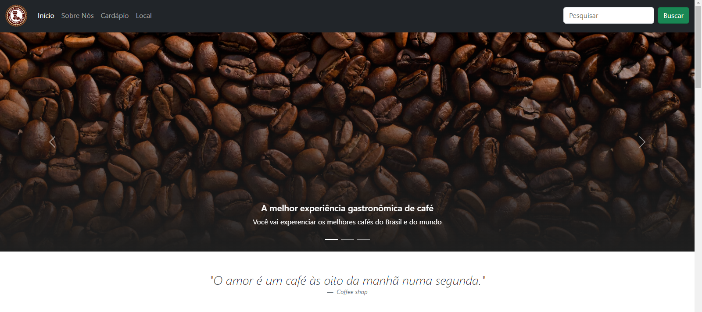

  

<h1>Coffee Shop Layout</h1>

<h3>Sobre o projeto: </h3>

Este projeto foi idealizado pela <b>Michele Ambrosio</b> (https://github.com/micheleambrosio) na plataforma <b>DIO</b> (https://web.dio.me)

Conciste em colocar em prática os ensinamentos da Formação CSS Web Developer.

Criando um layout de uma cafeteria.

<h3>Ferramentas usadas:</h3>
<ul>
    <li>HTML</li>
    <li>CSS</li>
    <li>Bootstrap</li>
</ul>

<h3>Licença:</h3>

MIT License

<h3>Contato:</h3>

matheuscauahub@gmail.com

